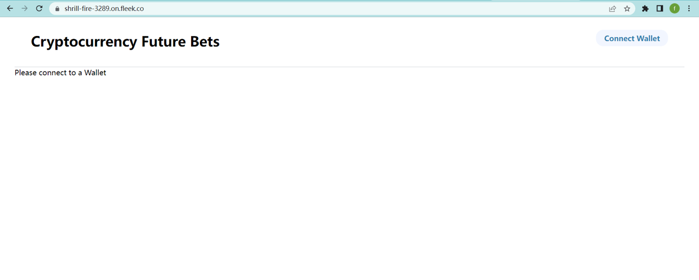
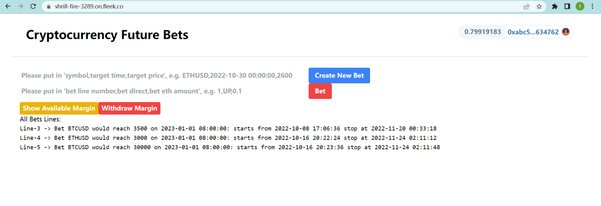

# Bet the price of a cryptocurrency would be above some price at a future time or not.
## This DAPP is deployed on Sepolia testnet, so if you want to have a try, please switch to this testnet on your MetaMask Wallet and then come to this site: https://rough-night-4766.on.fleek.co/

## 1. Initial web page looks like as below:
 

  

## 2. It looks like as below after you click "Connect Wallet" button and have connected MetaMask Wallet:
 

  

## 3. Now you can fill "bet input" and click "Bet" button to start your bets.

For example, fill "bet input" with "5,UP,0.01" means bet 0.01 ETH on "Line-5" that price of BTCUSD would be above 30000 at 2023-01-01 08:00:00; and similar "4,DOWN,0.03" means bet 0.03 ETH on "Line-4" that price of ETHUSD would be below 3000 at 2023-01-01 08:00:00. 

Notes: bet value should not be less than 0.01 ETH.

## 4. If you don't want to bet on these lines(Line-3, Line-4, Line-5), you can create a new Line: fill "'Create New Bet' input box" and click "Create New Bet" button, then you would see "Line-6".

For example, fill "'Create New Bet' input box" with "ETHUSD,2024-01-01 00:00:00,5000"; 

"ETHUSD" is the bet symbol which can only be BTCUSD, BTCETH, ETHUSD, FORTHUSD, LINKUSD or LINKETH because of on Goerli testnet;

"2024-01-01 00:00:00" is the bet target time (accurate to hour) when "win" or "loss" comes out;

"5000" is the bet target price.

## 5. You can click "Show Available Margin" button to see how many ETHs you have in this bet pool until now and click "WithDraw Margin" button to withdraw them to your Wallet.
